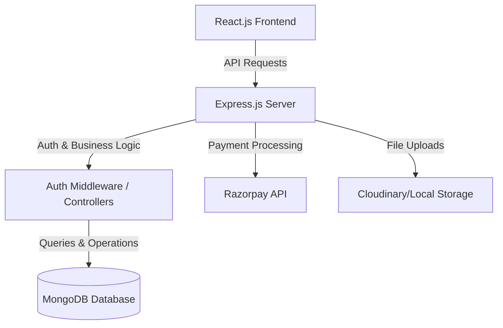

# Implementation Plan - MERN E-Commerce Platform

This plan outlines the design, architecture, database schemas, and step-by-step implementation roadmap for building a professional **Nazara Diamonds-style E-commerce website**.

---

## 1. Project Architecture & Stack

We will build a full-stack MERN application structured as follows:



### Stack Details:
*   **Frontend**: React (Vite), Tailwind CSS (for modern UI), React Router DOM, Zustand (for lightweight global state), Axios (API calls).
*   **Backend**: Node.js, Express.js, JWT (Authentication), bcryptjs (Password hashing), Multer (File upload).
*   **Database**: MongoDB with Mongoose ODM.

---

## 2. Database Schema Designs

We need four core MongoDB schemas: **User**, **Product**, **Order**, and **Offer**.

### A. User Schema (`User.js`)
```javascript
const userSchema = new mongoose.Schema({
  name: { type: String, required: true },
  email: { type: String, required: true, unique: true },
  password: { type: String, required: true },
  role: { type: String, enum: ['user', 'admin'], default: 'user' },
  createdAt: { type: Date, default: Date.now }
});
```

### B. Product Schema (`Product.js`)
To match Nazara Diamonds, a product will have selectable variations (9KT/14KT/18KT, Metal Color, Size, etc.) and an inventory status.
```javascript
const productSchema = new mongoose.Schema({
  name: { type: String, required: true },
  description: { type: String, required: true },
  basePrice: { type: Number, required: true }, // 9KT base price
  category: { type: String, required: true, enum: ['Rings', 'Earrings', 'Necklaces', 'Pendants', 'Bracelets & Bangles'] },
  images: [{ type: String }], // Cloudinary URLs
  specifications: {
    diamondColor: { type: String, default: 'D-E-F' },
    diamondQuality: { type: String, default: 'VVS-VS' }
  },
  variations: {
    metals: [{ type: String, enum: ['9KT', '14KT', '18KT'] }],
    colors: [{ type: String, enum: ['Rose Gold', 'White Gold', 'Yellow Gold'] }],
    sizes: [{ type: String }] // Ring or bangle sizes
  },
  inventory: { type: Number, required: true, default: 10 },
  ratings: { type: Number, default: 0 },
  createdAt: { type: Date, default: Date.now }
});
```

### C. Offer Schema (`Offer.js`)
For managing festival offers (Diwali, Rakshabandhan, etc.) directly from the admin panel.
```javascript
const offerSchema = new mongoose.Schema({
  name: { type: String, required: true }, // e.g., "Diwali Dhamaka", "Rakhi Special"
  code: { type: String, required: true, unique: true }, // e.g., "DIWALI20"
  discountType: { type: String, enum: ['percentage', 'fixed'], default: 'percentage' },
  discountValue: { type: Number, required: true }, // e.g., 20 for 20%
  minPurchaseAmount: { type: Number, default: 0 },
  startDate: { type: Date, required: true },
  endDate: { type: Date, required: true },
  isActive: { type: Boolean, default: true }
});
```

### D. Order Schema (`Order.js`)
```javascript
const orderSchema = new mongoose.Schema({
  user: { type: mongoose.Schema.Types.ObjectId, ref: 'User', required: true },
  items: [{
    product: { type: mongoose.Schema.Types.ObjectId, ref: 'Product', required: true },
    name: { type: String, required: true },
    quantity: { type: Number, required: true },
    selectedMetal: { type: String },
    selectedColor: { type: String },
    selectedSize: { type: String },
    price: { type: Number, required: true }
  }],
  shippingAddress: {
    address: { type: String, required: true },
    city: { type: String, required: true },
    postalCode: { type: String, required: true },
    phone: { type: String, required: true }
  },
  paymentMethod: { type: String, required: true, default: 'Razorpay' },
  paymentResult: {
    id: { type: String },
    status: { type: String },
    email_address: { type: String }
  },
  itemsPrice: { type: Number, required: true },
  discountApplied: { type: Number, default: 0 },
  totalPrice: { type: Number, required: true },
  isPaid: { type: Boolean, default: false },
  paidAt: { type: Date },
  orderStatus: { type: String, enum: ['Processing', 'Shipped', 'Delivered', 'Cancelled'], default: 'Processing' },
  createdAt: { type: Date, default: Date.now }
});
```

---

## 3. Project Directory Structure

We will create a clean and scalable folder structure:

```text
nazara-diamonds-project/
├── server/                    # Node.js + Express Backend
│   ├── config/                # Database config & key settings
│   ├── controllers/           # API handlers
│   ├── middleware/            # Auth & error handlers
│   ├── models/                # Mongoose Database models
│   ├── routes/                # Express API endpoints
│   ├── uploads/               # Local temp folder for Multer
│   ├── .env                   # Environment variables
│   ├── package.json
│   └── server.js              # Application entry point
└── client/                    # React Frontend (Vite)
    ├── public/
    ├── src/
    │   ├── assets/            # Fonts, images
    │   ├── components/        # Reusable UI parts (Navbar, Footer, ProductCard)
    │   ├── context/store/     # Global state (Zustand)
    │   ├── pages/             # Page components (Home, ProductDetail, Cart, Admin)
    │   ├── App.jsx
    │   ├── index.css          # Tailwind setup and custom colors
    │   └── main.jsx
    ├── tailwind.config.js
    └── package.json
```

---

## 4. Implementation Steps & Checklist

We will build the system iteratively:

### Phase 1: Backend Setup
- [ ] Initialize `server/` directory and install packages (`express`, `mongoose`, `cors`, `dotenv`, `jsonwebtoken`, `bcryptjs`, `multer`).
- [ ] Create MongoDB connection in `config/db.js`.
- [ ] Build models (`User`, `Product`, `Order`, `Offer`).
- [ ] Create JWT authentication middleware and user controllers (Register/Login).
- [ ] Create Product CRUD endpoints (restricted to Admin).
- [ ] Create Offer/Coupon endpoints (restricted to Admin).
- [ ] Create Order creation and retrieval endpoints.

### Phase 2: Frontend Setup
- [ ] Initialize `client/` directory with React (Vite) and Tailwind CSS.
- [ ] Configure the styling tokens matching Nazara Diamonds' luxury plum (`#4A2C40`) and gold (`#C59B27`) aesthetics.
- [ ] Set up React Router DOM for routing.
- [ ] Create shared components: Navbar (with cart counter), Footer, and Loading Spinners.

### Phase 3: Core User Features
- [ ] Build Product Catalog page (`/products`) with sidebar filters (category, metal, highlights).
- [ ] Build Product Detail page with variation selectors (metal KT, color, size) and dynamic price calculation.
- [ ] Build Shopping Cart logic using Zustand (persist cart in localStorage).
- [ ] Build Checkout page with order summary, shipping address form, and dynamic discount coupon code verification (Festival Offers).

### Phase 4: Admin Panel & Dashboard
- [ ] Create Admin Dashboard layout with sidebar navigation (Products, Orders, Offers).
- [ ] Build Admin Product Management view (Add, edit, delete products with image upload).
- [ ] Build Admin Festival Offer Management view (Create discount codes, start/end dates, activate/deactivate).
- [ ] Build Admin Order Management view (View all orders, change order status from Processing to Shipped/Delivered).

### Phase 5: Payment Gateway & Polish
- [ ] Integrate Simulated Razorpay Checkout on frontend & backend payment verification.
- [ ] Polish UI with smooth transitions and glassmorphism banners.
- [ ] Test the full user-to-admin workflow.
